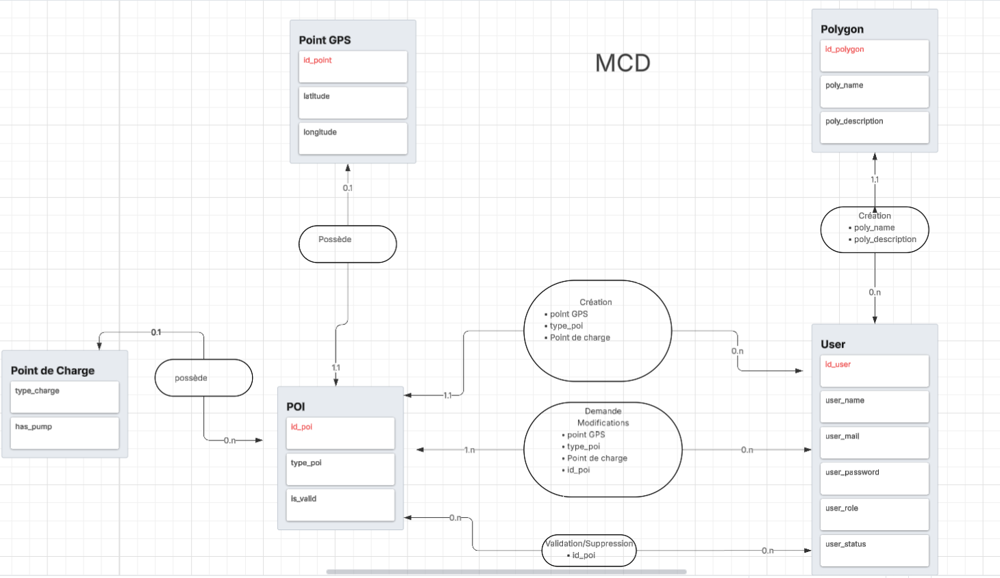
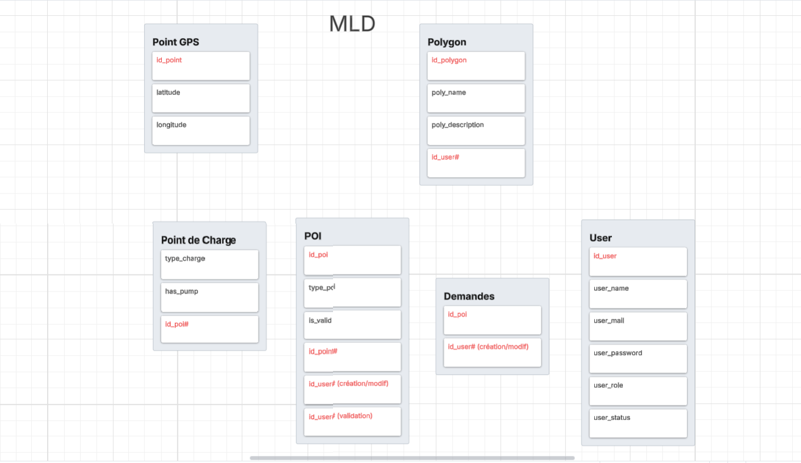
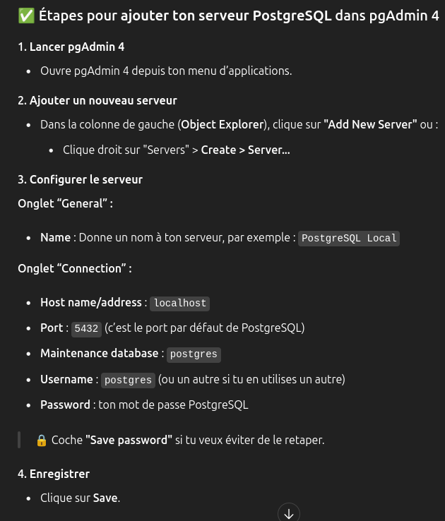
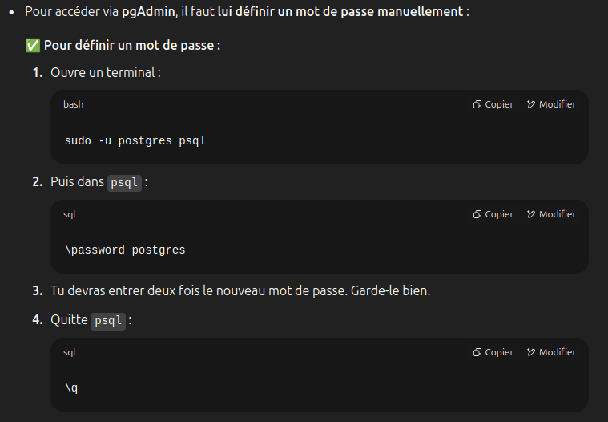

# Memo : Base de Donnée

## Culture
<ins>Base de Donnée :</ins>


<ins>Bases de données relationnelle (RDBMS) :</ins> table où les données sont organisées en lignes et colonnes, idéal pour transactions complexes et une forte consistance des données. Défaut : Scalabité horizontal
- exemples :   MySQL, PostgreSQL, Oracle

<ins>Bases de données Columnar (RDBMS) :</ins> table où il y a beacoup de collones colonnes, idéal pour aggrégations de lignes, data science
- exemples :   Cassandra, Hbase, Bigquery, Redshift

<ins>Bases de données NoSQL :</ins> système clé-valeur (Redis) pour les données, idéal pour  accés rapide à une donnée, scalabilité horizontale, gros volume de donnée.
 - exemples :   MongoDB, Reddis

<ins> Base de données de Graph :</ins>
ex: Neo4j, Neptune, Arangodb

<ins>Bases de données Distribuées :</ins> La gestion est traitée par un réseaux de noeux (ordinateur) interconnecté qui stock les données de manière distribuée.
 - exemples :   Amazon DynamoDB, H2(en Java, pour le test et dev)


<ins>TimeSeries Data Base (TSDB) :</ins> Idea pour les valeurs capté dans le temps, bonne compression pour les données qui évoluent peu, pas de modification possible à part la compaction ex. Prometheus, Grafite, Influxdb 

<ins>Base de donnée Vectorielle :</ins> optimisé pour vecteur de chiffre pour application IA, search engine  ex. Pinecone, Weaviate, Qdrant

PostgreSQL peut utliser les relational querry (SQL) et les  non-relational querry (JSON)

<div>Exemple : JSON</div> 


```JSON
{
    "menu": {
        "id": "file",
        "value": "File",
        "popup": {
            "menuitem": [
                { "value": "New", "onclick": "CreateNewDoc()" },
                { "value": "Open", "onclick": "OpenDoc()" },
                { "value": "Close", "onclick": "CloseDoc()" }
            ]
        }
    }
}
```
CAP Theorem:
Il est impossible pour un système de BDD distribuée de garantir simultanément:
1. Consistency (Cohérence) : Tous les nœuds voient les mêmes données au même moment. Une lecture garantit de retourner le résultat de la dernière écriture.
2. Availability (Disponibilité) : Chaque requête reçoit une réponse, sans garantie que cette réponse soit la plus récente. Le système est opérationnel et répond aux requêtes même en cas de panne de certains nœuds.
3. Partition Tolerance (Tolérance aux partitions): Le système continue de fonctionner malgré des partitions réseau. Les nœuds peuvent être divisés en plusieurs groupes qui ne peuvent pas communiquer entre eux.

Utiliser Postgre en ligne de commande
```bash
(base) tmari@PYTHON-02:/etc/apt/sources.list.d$39,16:09$sudo su - postgres
postgres@PYTHON-02:~$ psql
psql (16.9 (Ubuntu 16.9-0ubuntu0.24.04.1))
Type "help" for help.

postgres=# 
```

Client SQL pgAdmin 4 (GUI)

## Méthode Merise
mcd link\
https://lucid.app/lucidchart/b4f18760-c71a-47d8-8276-abb10f3241bf/edit?viewport_loc=-542%2C-2399%2C4791%2C2523%2Czok3yUf69dyn&invitationId=inv_658f19f1-8868-4c81-b1c6-d583529cc4c1

mld link\
https://lucid.app/lucidchart/f0593e8f-dc08-4dbe-a907-eab8b8c2c4d1/edit?viewport_loc=-480%2C-326%2C3194%2C1682%2C0_0&invitationId=inv_d5de9322-d84d-401d-aaf8-7de608b00d2f

## SQL and querry
```SQL
CREATE TABLE cars (
  brand VARCHAR(255),
  model VARCHAR(255),
  year INT
); 
```

## pgadmin setting

 

